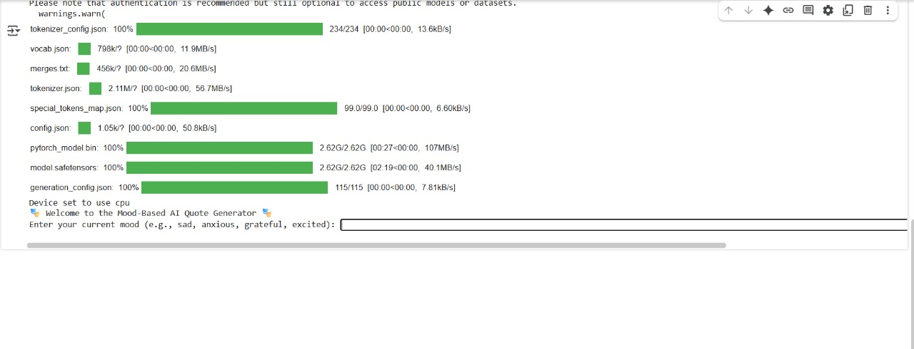

# 🎭 Mood-Based AI Quote Generator

This is a simple and fun **Generative AI project** that generates short inspirational quotes based on your current mood.

You enter a mood like `"sad"`, `"anxious"`, `"grateful"`, or `"motivated"` — and the AI responds with a relevant quote using a lightweight, open-source language model.

---

## 🌟 Features

- 🧠 Mood-based inspirational quote generation
- 💬 Text-to-text generation using `falcon-rw-1b` from Hugging Face
- 🎛️ CLI and Streamlit versions included
- 🖥️ Works fully on **Google Colab** (no API key needed!)
- ✅ Runs on **CPU** (no GPU required)

---

## 🔧 Technologies Used

- [Hugging Face Transformers](https://huggingface.co/docs/transformers)
- [Falcon RW-1B model](https://huggingface.co/tiiuae/falcon-rw-1b)
- [Streamlit](https://streamlit.io/) (for frontend version)
- [ColabCode](https://github.com/abhishekkrthakur/colabcode) (to run Streamlit in Google Colab)

---

## 🚀 How to Run

### 🔹 Option 1: CLI Version (Colab/Local)

1. Open `project.txt` or copy the code into Google Colab
2. Run each cell step by step
3. Enter your mood when prompted
4. Get your quote in the terminal output

### 🔹 Option 2: Streamlit Version (Recommended)

1. Install dependencies:

```bash
pip install transformers accelerate streamlit colabcode
```

2. Save the Streamlit code to `quote_app.py` (you can get this from the notebook)
3. In Colab or terminal:

```python
from colabcode import ColabCode
ColabCode(port=8501, code_file="quote_app.py")
```

4. Open the provided `ngrok` public URL in your browser
5. Select a mood → receive your quote

---

## 💡 Example

```
Mood: sad

📝 "Don't cry because it's over, smile because it happened." — Dr. Seuss
```

---

## 📸 Screenshots




---


---

## 📁 Files

- `project.txt` - Raw Python script (CLI version)
- `quote_app.py` - Streamlit app version (auto-generated in Colab)
- `output.jpg` - Sample output (CLI)
- `output img.jpg` - Sample output (Streamlit)

---

## 🤖 Model Info

We use the [Falcon-RW-1B](https://huggingface.co/tiiuae/falcon-rw-1b), a lightweight causal language model that can generate fluent and meaningful text from simple prompts. It's optimized for CPU inference and works great in Colab.

---

## 📝 License

This project is open-source under the MIT License.

---

## 🙌 Credits

- Hugging Face for hosting open models
- TII UAE for Falcon-RW-1B
- Streamlit & ColabCode for easy UI integration

---

## 🔗 Links

- [Live in Colab (coming soon)]()
- [Model card](https://huggingface.co/tiiuae/falcon-rw-1b)
- [Streamlit](https://streamlit.io)

---

> "Let your mood guide the message. Let AI inspire the moment." ✨


---
